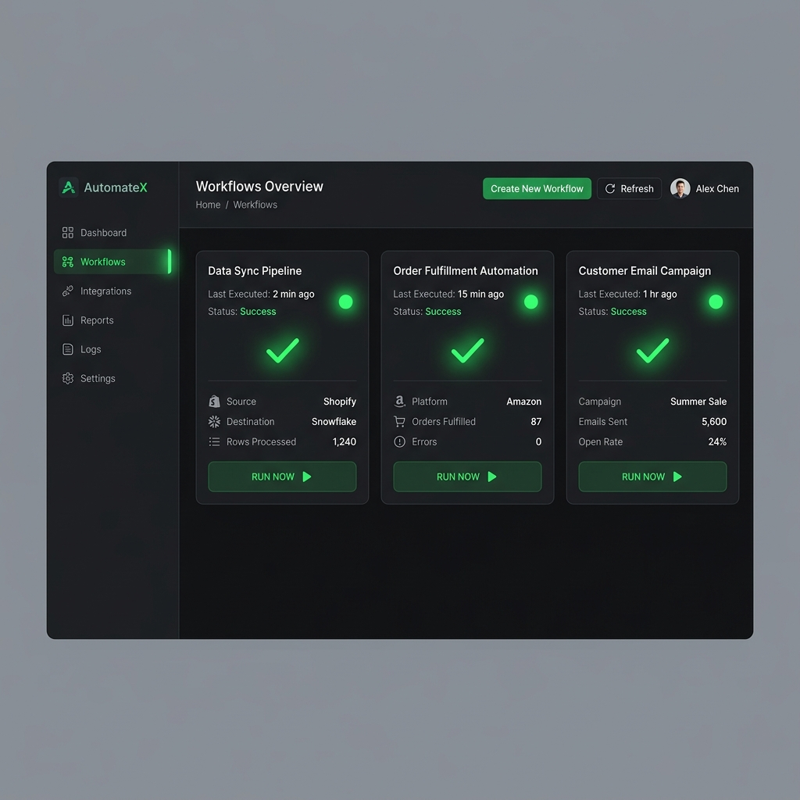
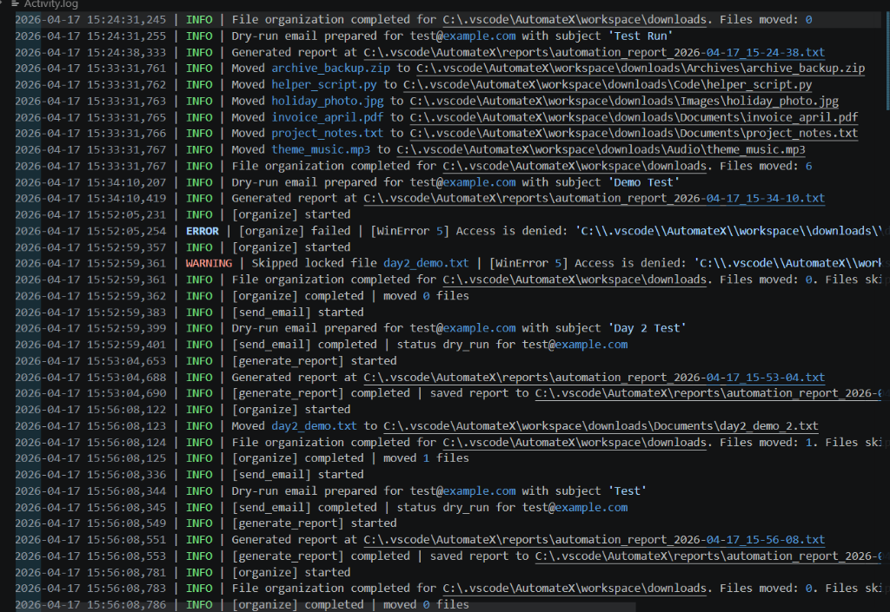

# AutomateX 🚀

## Overview
A full-stack automation system built with Python and Flask that allows users to automate file organization and email tasks through a web dashboard.

## Features
- File automation system
- Email automation
- Logging system
- REST API backend
- Web-based dashboard

## Architecture
Frontend → Flask API → Controller → Modules → Logs

## Tech Stack
- Python
- Flask
- HTML/CSS/JS

## Screenshots


## Demo


## How to Run

1. Clone the repository to your local machine:
   ```bash
   git clone https://github.com/yourusername/automatex.git
   cd automatex
   ```

2. Install backend dependencies (Flask is required):
   ```bash
   pip install flask
   ```

3. Configure your local environment variables (Optional but required for full Email automation functionality):
   ```bash
   export AUTOMATEX_SENDER_EMAIL=your_email@example.com
   export AUTOMATEX_SENDER_PASSWORD=your_app_password
   export AUTOMATEX_SMTP_SERVER=smtp.gmail.com
   ```

4. Start the Application Server:
   ```bash
   python app.py
   ```

5. Access the Dashboard:
   Open your browser and navigate to `http://127.0.0.1:5000` to interact with the premium UI.
